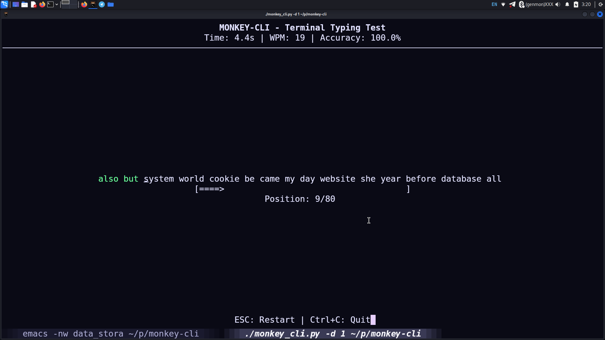

# Monkey-CLI
Monkeytype clone for terminal. De-vibecoded fork.


## Installation

Clone this repository:
```bash
git clone https://github.com/arbkm22/monkey-cli.git
cd monkey-cli
```

No external dependencies needed! The application uses Python's built-in `curses` library.


## Usage
### run with default settings
```bash
chmod +x monkey_cli.py
./monkey_cli.py
```

## output of ./monkey_cli.py -h
```bash
options:
  -h, --help            show this help message and exit
  -d, --duration DURATION
                        test time in seconds.
  -w, --word-count WORD_COUNT
                        amount of words.
  -H, --history         display history.
  -l, --list LIST       dictionary list to use
```


# Screenshot

